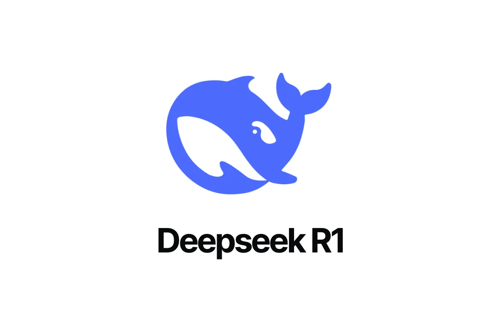
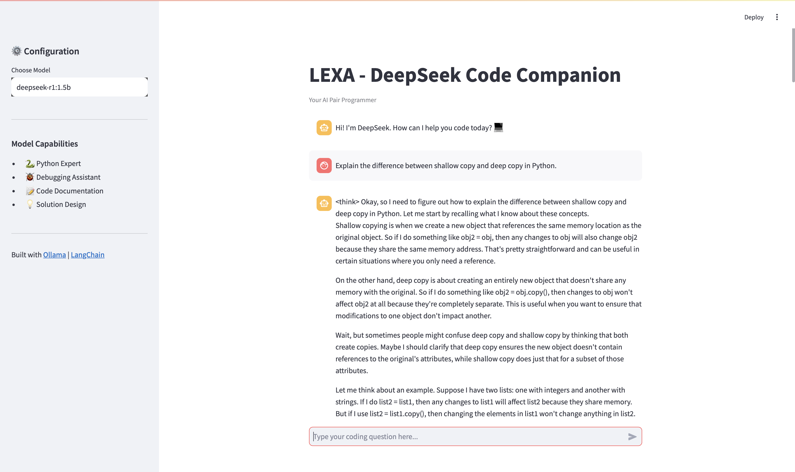
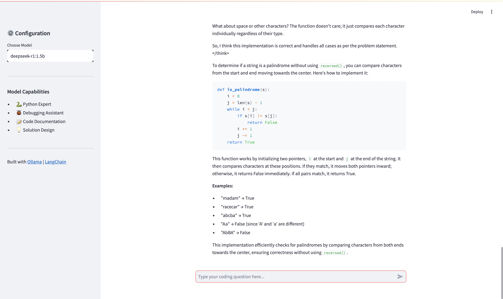

# 🧠 LEXA 
### Your Local AI Pair Programmer & Debugging Assistant  

🚀 **LEXA** is a Streamlit-based coding companion powered by **Ollama** and **LangChain**.  
It helps you write, debug, and understand code — all locally, with **zero cloud dependencies**.  

---

## ⚙️ Features  

- 🐍 **Expert in Python** (supports multi-language discussions)  
- 🐞 **Smart debugging assistance** with clear reasoning  
- 🧩 **Context-aware chat memory**  
- 🧠 **Built on DeepSeek (R1 models)** via Ollama  
- 💬 **Clean, chat interface**  

---

## 🏗️ Tech Stack  

<p align="center">
  
  
  
  
</p>

| Component | Description |
|------------|-------------|
| **Streamlit** | UI Framework |
| **LangChain** | Conversational pipeline |
| **Ollama** | Local LLM backend |
| **DeepSeek R1 (1.5B / 3B)** | Model choices |


---

## 📦 Installation  

### 1️⃣ Install Ollama  
Download Ollama from 👉 [https://ollama.ai/download](https://ollama.ai/download)

### 2️⃣ Pull the DeepSeek models  
```bash
ollama pull deepseek-r1:1.5b
ollama pull deepseek-r1:3b
```

### 3️⃣ Clone this Repository  

```bash
git clone https://github.com/your-username/codeforge-ai.git
cd codeforge-ai
```

### 4️⃣ Install Dependencies  

```bash
pip install streamlit langchain langchain-ollama
```

### 🚀 Run the App

Make sure Ollama is running, then start Streamlit:

```bash
streamlit run app.py
```

### 🧩 Usage  

- Choose a model (`deepseek-r1:1.5b` or `deepseek-r1:3b`)  
- Type your coding question or paste your code  
- Get instant debugging help, explanations, or refactoring suggestions  

---

## 🌑 Example Use Cases  

- Debugging Python scripts  
- Writing documentation  
- Getting algorithm explanations  
- Generating boilerplate code  
- Learning programming interactively  

---

## 🧠 Architecture Overview  

```text
User Query 
   ↓
LangChain Prompt Pipeline 
   ↓
DeepSeek via Ollama 
   ↓
AI Response 
   ↓
Streamlit UI
```
## 🛠️ Folder Structure  

```text
codeforge-ai/
│
├── app.py                 # Main Streamlit app
├── requirements.txt       # Dependencies
└── README.md              # Project info
```

## USER INTERFACE





## 🔒 Data Privacy

One of the key benefits of using **DeepSeek with Ollama** is that all AI processing happens **locally on your device** — not in the cloud.  
This means:

- The model runs directly on your machine through Ollama.  
- Your prompts, code, and responses **never leave your computer**.  
- No external APIs or servers are used unless you explicitly connect them.  

In short, **your data stays private and secure**, making this app ideal for developers who value privacy while leveraging AI.


## FURTHER 
we can add the capaility to upload images, audios etc so that they stay on edge and your data satys private.